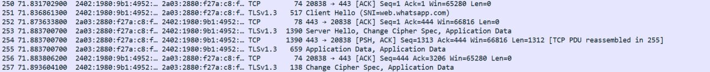

# Personal Career Development Portfolio

## Student Information
Name: Wan Alyaa Nasuha Binti Wan Shaari  
Course: Computer Science / Information Technology  
Subject: CSA30203 Special Topics in Computer Network Security  

---

# Career Exploration  
## Software Developer (Security-Focused)

### Career Overview
A Software Developer (Security-Focused) is responsible for developing and designing software applications that is strongly focus on security. This role combines software development skills with cybersecurity knowledge to ensure the applications can against cyber threats and vulnerabilities.   

This role also has been to evolve from traditional to a modern along with latest technology. The traditional scope only focus on system functionality and also implemet security measures to prevent cyber threats and vulnerabilities such as SQL Injection, XSS, unauthorized access, ransomware and data breaches.  

Now, the modern one, not only focused on system functionality but also relying on web application, cloud systems and online platforms. Therefore, the security also become increasingly important in the cybersecurity industry.  

---

## Job Responsibilities
The responsibilities of a Security-Focused Software Developer include:

- Designing and developing secure software applications
- Conducting Security analysis
- Developing authentication and authorization mechanisms
- Developing encryption and decryption algorithms
- Providing technical support
- Staying up-to-date on security threats
- Participating in code reviews

---

## Variation of Software Developers(Security-Focused)  
- Application Security Developers
- Network Security Developers
- Cryptography Developers
- Mobile Security Developers
- Cloud Security Developers

---

## Required Skills

### Technical Skills
- Programming languages such as Python, PHP, Java, and JavaScript
- Web and mobile application development
- Database management using MySQL or PostgreSQL
- API development and integration
- Git and GitHub version control
- Basic networking and operating system knowledge

### Cybersecurity Skills
- Secure coding practices
- Authentication and authorization
- Password hashing and encryption
- Knowledge of common cyberattacks:
  - SQL Injection
  - Cross-Site Scripting (XSS)
  - Unauthorized access
  - Phishing
  - Data Breaches
  - Ransomware
- Vulnerability testing and debugging
- Understanding of OWASP Top 10 security risks

### Soft Skills
- Problem-solving
- Communication skills
- Teamwork
- Critical thinking
- Continuous learning

---

## Relevance to Modern Cybersecurity
This career is highly relevant in modern cybersecurity because many cyberattacks target vulnerable software applications. Organizations today rely heavily on digital systems, cloud services, mobile applications, and online platforms to manage operations and store sensitive information.

Security-focused software developers help organizations:
- reduce security vulnerabilities
- protect user data and privacy
- improve system reliability
- implement secure authentication systems
- strengthen overall cybersecurity posture

As cyber threats continue to evolve, companies increasingly require developers who understand both software engineering and cybersecurity principles. Therefore, the demand for Security-Focused Software Developers continues to grow in the modern IT industry.

# Personal Skills Assesment

This section evaluates the degree of my readiness based on comparison between my existing abilities and those required by the cybersecurity industry.

## i. Identification of Current Skills

Technical Skills

- Cybersecurity Research Skills: Be acquainted with techniques of data exfiltration analysis and the effects of ransomware attacks on the supply chain.
- Information Gathering and Network Monitoring: Skilled in using Wireshark to monitor and analyze suspicious traffic in the network for security audits.
- Communication Security: Familiar with the use of Mailvelope for managing encrypted emails to secure organizational communications.
- Source Code Management and Scripting: Utilizing GitHub to maintain source code systematically and Python programming language to develop basic scripts.
- Frontend Design and Data Display: Skillful in developing efficient interfaces and maintaining integrity of data display through HTML, CSS, and JavaScript.

Soft Skills

- Team Collaboration: Worked in a group setting to execute complicated cybersecurity research projects.
- Profession Communication Skills: Communicate about the progress of your project formally to your supervisor, reviewer panel, and lecturer.
- Analysis Skills: Analyze the technical reviews for feedback to improve your system architectur

## ii. Comparison: Current Skills vs Industry Requirements

| Industry Requirement | Current Skills |
|---|---|
| Security Audit & Monitoring | Implement Wireshark proactively to monitor and identify anomalies in network traffic. |
| Communications Confidentiality Management | Maintain the integrity and confidentiality of data through implementation of Mailvelope encryption technology. |
| Code & Version Governance | Establish transparency in system development and proper version control through the GitHub platform. |
| Project Leadership & Collaboration | Demonstrate good Teamwork and Communication skills to handle security projects professionally. |

---

# Career Development Plan

My career goal is to become a Software Developer specializing in secure application development. I want to build secure systems and websites that are protected from cyber threats and unauthorized access.

## Certifications

I plan to take several certifications to improve my technical and cybersecurity knowledge:

- CompTIA Security+
- Google Cybersecurity Certificate
- AWS Cloud Practitioner

These certifications can help me strengthen my understanding of cybersecurity, networking, and cloud security.

---

## Tools and Technologies to Learn

To achieve my career goal, I plan to improve my skills using the following tools and technologies:

- Python
- GitHub
- Wireshark
- Mailvelope
- HTML, CSS, and JavaScript

I also want to learn secure coding techniques to prevent vulnerabilities such as SQL injection, cross-site scripting, and unauthorized access in web applications.

---

## Career Timeline

| Timeline | Goal |
|---|---|
| 6 Months | Improve programming skills in HTML, CSS, JavaScript, and Python |
| 1 - 2 Years | Learn secure coding and build portfolio projects using GitHub |
| 3 - 5 Years | Work as a Security-focused Software Developer |

---

## Future Development Goals

In the future, I want to continue learning modern software security practices and gain real-world experience through projects, internships, and self-learning. I also hope to contribute to developing secure applications that protect user data and system security.

## EVIDENCE OF LEARNING

On image 1, show the conducted using Wireshark to analyze network traffic.
The captured packets use protocols such as QUIC and TLSv1.3, which are commonly used for secure internet communication.
Through this task, I learned basic packet analysis and network monitoring skills.
The wireshark show the traffic by client hello and server hello. 

On image 2, shows encrypted network communication captured using Wireshark with the TLSv1.3 protocol. 
The packets include Client Hello, Server Hello, Change Cipher Spec, and Application Data,
which are part of the secure connection process.

## e) Personal Reflection

| Reflection Area | Explanation |
|---|---|
| Dream Company | Nexagate Sdn. Bhd. |
| Career Interest | Software Developer (Security-focused) |
| Reason for Choosing | I am interested in cybersecurity, secure software development, and protecting systems from cyber threats. Nexagate’s involvement in digital security solutions matches my career interests and future goals. |
| Why I Want to Work There | I want to gain real industry experience, improve my technical skills, and learn more about secure systems and cybersecurity technologies in a professional working environment. |
| Value I Can Bring | I can contribute through my willingness to learn, teamwork skills, responsibility, adaptability, and strong interest in technology and cybersecurity. |
| Why Should They Hire Me | I am motivated to continuously improve my skills and contribute positively to the company. I am also hardworking, responsible, and eager to learn new technologies related to secure software development. |
| Technical Skills | Python, Java, PHP, JavaScript, Web Development, Database Management, Git & GitHub, Basic Cybersecurity Knowledge, Secure Coding Practices, Wireshark, Mailvelope |
| Soft Skills | Problem-solving, Communication Skills, Team Collaboration, Time Management, Critical Thinking, Adaptability |
| Strengths | Fast learner and willing to improve continuously; Good teamwork and communication skills; Responsible and committed to completing tasks; Strong interest in cybersecurity and secure software development; Able to adapt to new technologies and environments |
| Weaknesses | Sometimes I spend too much time making sure my work is perfect; Limited industry experience because I am still a student; Occasionally nervous when presenting in front of large audiences, but I am improving through practice and teamwork activities ||
